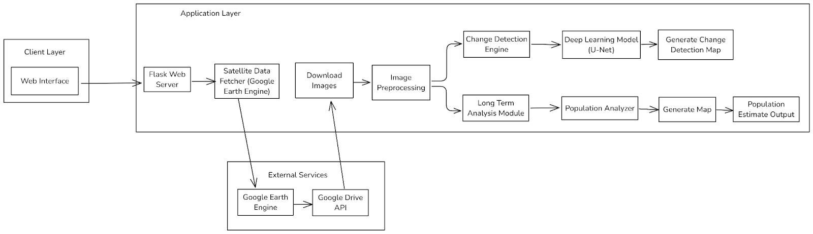
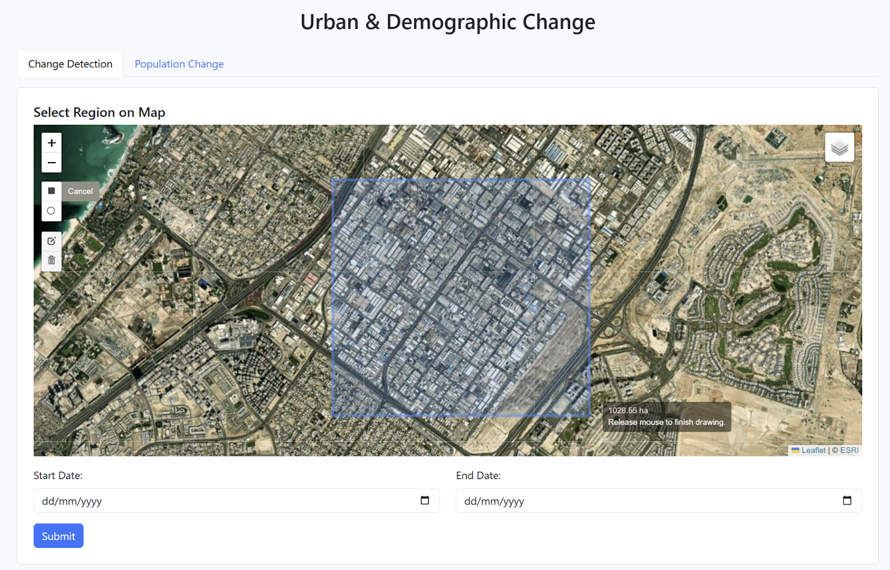
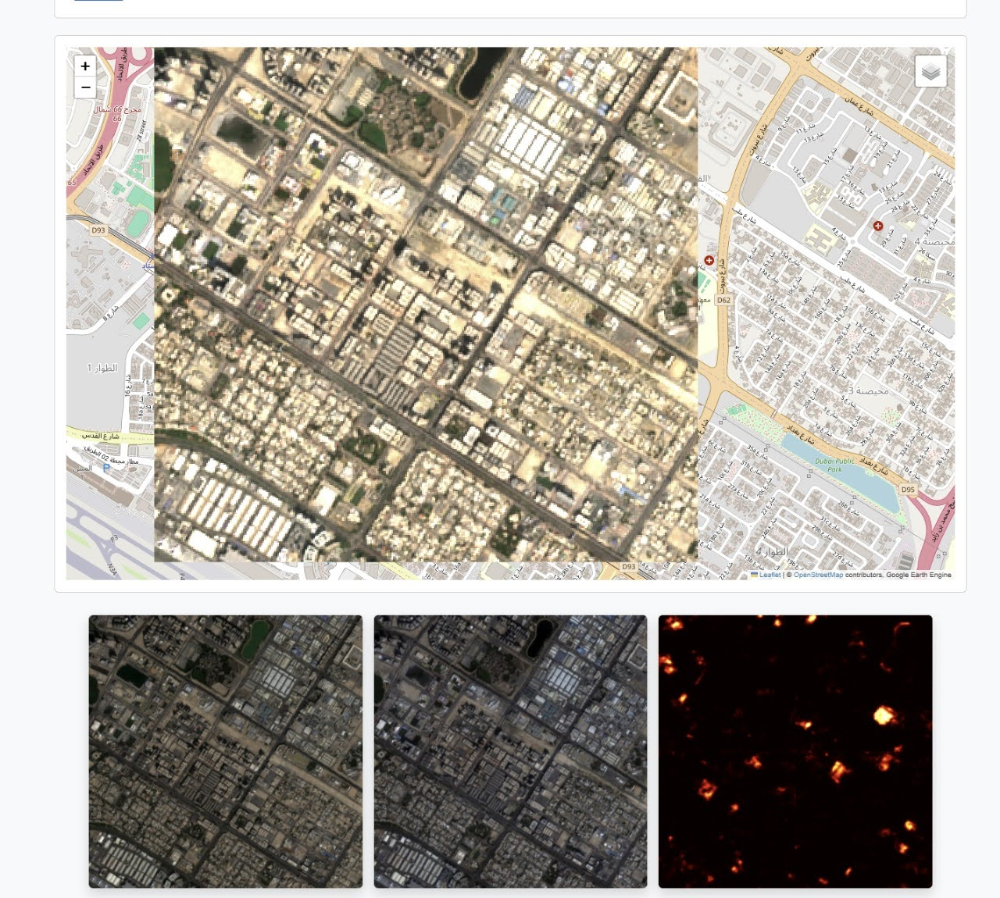
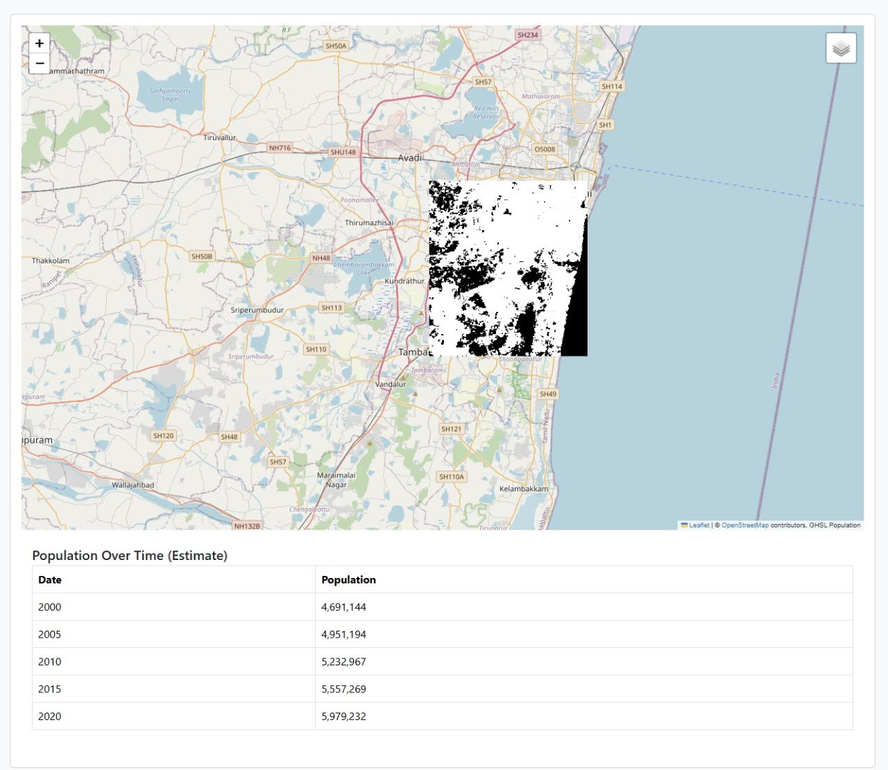

# 🌆 Urban Change Detection

This project presents an integrated **web-based platform** for **urban change detection** and **long-term land use analysis**, combining remote sensing, deep learning, and population analytics.

It leverages **multi-temporal satellite imagery** from **Sentinel-1 (SAR)** and **Sentinel-2 (optical)**, processed through **Google Earth Engine (GEE)**, to identify and analyze urban transformation over time.

### 🔍 Key Features

* **UNet Model** for change detection.
* Fusion of **SAR (Sentinel 1) + Optical data (Sentinel 2)** for improved accuracy.
* **Flask-based web interface** for interactive AOI selection and real-time result visualization.
* Integration with **Global Human Settlement Layer (GHSL)** for demographic change insights.

---

## 🧠 System Architecture

---

## 🧩 Key Components

### 1. Google Earth Engine (GEE)

GEE serves as the backbone for satellite data acquisition and preprocessing via Earth Engine's Python API:
  * Users define ROIs and date ranges.
  * Sentinel-1 & Sentinel-2 imagery is filtered and fetched.
  * Processed data and indices are exported as `.tif` files for downstream modeling.

---

### 2. Flask Web App

Acts as the user interface and system orchestrator:

* **User Inputs**:

  * Specify city name, custom date range, or draw a polygon for AOI.

* **Backend Interaction**:

  * Fetches imagery via GEE scripts.
  * Triggers the model for inference and displays predictions.

---

### ⚙️ Implementation

#### Tools & Technologies

* **Platform**: Google Earth Engine, Google Colab
* **Programming Languages**: JavaScript, Python, HTML/CSS
* **Backend Framework**: Flask
* **Visualization**: Folium

---

### 🗂 Dataset

**SpaceNet 7 Multi-Temporal Urban Development Challenge**

* **Format**: GeoTIFF (imagery), GeoJSON (building footprints)
* **Content**: High-resolution satellite image sequences for various ROIs, with annotated building changes over time.

---

## 📸 Outputs

---

## 📚 References

* **Sebastian Hafner’s Semi-Supervised Multi-Modal Change Detection Repository**
  [https://github.com/SebastianHafner/SemiSupervisedMultiModalCD](https://github.com/SebastianHafner/SemiSupervisedMultiModalCD)
  *Reference implementation for multi-modal change detection using SAR and optical imagery.*

* **Papadomanolaki, M., Vakalopoulou, M., & Karantzalos, K. (2021).**
  *A Deep Multitask Learning Framework Coupling Semantic Segmentation and Fully Convolutional LSTM Networks for Urban Change Detection.*
  *IEEE Transactions on Geoscience and Remote Sensing, 59(9), 7651–7668.*
  [DOI: 10.1109/TGRS.2021.3055584](https://doi.org/10.1109/TGRS.2021.3055584)

* **SpaceNet 7: Multi-Temporal Urban Development Challenge**
  [Kaggle Link](https://www.kaggle.com/datasets/amerii/spacenet-7-multitemporal-urban-development)
  *Dataset used for training and evaluating urban change detection models.*